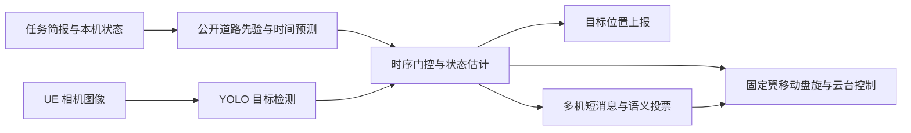

# HF2026 赛题一与赛题二自主协同算法

[](https://ubuntu.com/)
[](https://www.python.org/)
[](https://pytorch.org/)
[](https://docs.ultralytics.com/)

本项目面向红枫 2026 无人集群自主协同智能算法挑战赛，包含：

- 赛题一：单架固定翼无人机搜索并持续跟踪真实目标车；
- 赛题二：三架无人机协同识别真实目标车与诱饵车，完成双机持续盯防；
- 两套已训练的 YOLO 模型、数据转换与训练代码；
- Ubuntu 24.04、Python 3.12 的完整离线依赖；
- 一键安装、环境检查、训练回归和正式 UE 评测脚本；
- 可复现实验摘要及 PDF、Word 技术报告。

> [!IMPORTANT]
> 本仓库是官方 `hf2026-sim` 的增量算法包，不包含仿真引擎、UE 地图、Redis、前端及
> 官方数据集。运行前需要准备组委会发布的完整 Linux 仿真平台。

只需要安装和运行命令时，请直接阅读 [QUICKSTART.md](QUICKSTART.md)。

## 评测结果

| 赛题 | 平台 | 模式 | 时长 | 种子 | 总分 | 关键结果 |
| --- | --- | --- | ---: | ---: | ---: | --- |
| 赛题一 | v2.0.2 | UE eval | 600 s | 1 | **89.04** | passed，599 次上报，RMSE 5.005 m，零扣分 |
| 赛题二 | v2.0.3 | UE eval | 600 s | 1 | **92.96** | passed，3/3 摧毁，RMSE 4.419 m，近距扣 6 分 |
| 赛题二 | v2.0.2 | UE eval | 600 s | 1 | **96.97** | passed，3/3 摧毁，RMSE 3.734 m，近距扣 2 分 |
| 赛题二 | v2.0.2 | train | 320 s | 1 | **99.07** | passed，3/3 摧毁，RMSE 3.758 m，零扣分 |

精简评测记录保存在 [`evidence/`](evidence/)。最终成绩仍会受到组委会平台版本、随机路线、
天气、UE 渲染帧率及硬件状态影响。

## 方法概览



### 赛题一

赛题一使用任务简报允许访问的目标初始坐标匹配公开道路，通过任务相对时间预测车辆沿折线
运动的位置。固定翼控制器持续更新目标前方的 `set_destination`，使盘旋中心跟随车辆移动，
避免无人机只改变航向、仍围绕出生点转圈。

正式 UE 模式加载单类 YOLO 模型确认目标是否在画，并在 30° 搜索视场和 15° 跟踪视场间
动态切换。考虑到单目地理投影存在系统误差，视觉结果主要负责可见性校验和视场控制，不直接
覆盖精度更高的道路预测结果。路线无法匹配时，系统自动回退到视觉检测与二维常速度 Kalman
滤波。

### 赛题二

赛题二根据公开规则为三个目标分配道路，并使用官方 A* 展开后的折线进行导引。项目同时
提供 v2.0.2 与 v2.0.3 两套 A* 折线缓存，运行时根据官方平台根目录的 `VERSION` 自动选择，
避免新版“引擎内拼接”路线与旧版逐段拼接路线之间的几百米几何偏差。三架无人机
围绕当前目标形成三角锚点构型，使至少两架无人机持续盯防超过 20 秒，并为 200 米安全间隔
预留机动余量。精确路线模式使用 10° 跟踪视场，降低 v2.0.3 密集路网上相邻诱饵抢占原始
检测结果的概率。只有裁判返回的摧毁计数增加后，机群才切换到下一个目标。

道路未知时，算法进入 `SEARCH → VERIFY → TRACK` 状态机。二分类 YOLO 区分
`TargetVehicle` 与 `DecoyVehicle`；单机连续多帧形成语义票，两架无人机的新鲜语义票共同
确认真实目标。通信采用 `C/V/T/D/K` 五类短消息，单条不超过 50 字节，频率不超过 4 Hz。

## 仓库结构

```text
.
├── .gitattributes                  # 文本格式与二进制文件属性
├── .gitignore                      # 本地缓存和运行产物忽略规则
├── README.md
├── QUICKSTART.md                   # 最短安装与运行说明
├── install_offline.sh              # 安装算法、模型和离线 Python 环境
├── check_submission.sh             # 检查依赖、模型哈希和 Agent 入口
├── run_task1.sh                     # 运行赛题一
├── run_task2.sh                     # 运行赛题二
├── source/
│   ├── competition/user_algorithms/
│   │   ├── search_track/highscore_agent.py
│   │   ├── coop_decoy/highscore_agent.py
│   │   ├── route_prior.py
│   │   ├── perception_geometry.py
│   │   └── vision_sensor.py
│   ├── competition/scenarios/.../config/algorithm.yaml
│   ├── config/                      # 公开道路及 v2.0.2/v2.0.3 A* 折线缓存
│   └── scripts/                     # 运行、数据转换、训练和校验脚本
├── models/                          # 两套训练权重及指标
├── runtime/
│   ├── requirements.txt
│   ├── bin/uv                       # Linux x86-64 uv
│   └── wheels/                      # Python 3.12 完整离线 wheelhouse
├── evidence/                        # 精简评测证据
├── reports/                         # PDF 与 Word 技术报告
└── MANIFEST.sha256                  # 发布文件完整性校验
```

## 环境要求

- Ubuntu 24.04 x86-64；
- Python 3.12；
- 官方 Linux 版 `hf2026-sim` 完整发行包；
- 正式 UE 视觉评测建议使用 NVIDIA GPU，并至少保留 8 GiB 空闲显存；
- 训练回归模式不需要 UE 相机，也不强制要求 GPU。

`runtime/bin/uv` 和 `runtime/wheels/` 已随项目提供。安装脚本使用
`--offline --no-index`，不会访问网络，也不依赖系统的 `python3-venv` 包。

本项目使用 Git LFS 保存 `.pt` 模型、离线 wheel、PDF 和 Word 报告。从 Git 仓库获取时，
需要先安装并启用 Git LFS；否则工作区中只会出现很小的 LFS 指针文件：

```bash
sudo apt update
sudo apt install -y git-lfs
git lfs install
git clone https://github.com/fcs-z/hf2026_ws.git
cd hf2026_ws
git lfs pull
```

完整 `git lfs pull` 会同时下载约 2.8 GiB 的离线 wheelhouse。只需先检查模型时，可执行
`git lfs pull --include="models/*.pt"`；运行离线安装前仍应拉取全部 LFS 文件。

## 快速开始

### 1 准备官方仿真平台

已有官方完整平台时可跳过本步骤。新环境可执行：

```bash
git clone https://osredm.com/hf2026/hf2026-sim.git
cd hf2026-sim
git lfs pull
```

确认平台根目录至少包含 `opensim-sim`、`bin/redis-server`、`competition/sdk` 和
`start.sh`。

### 2 离线安装本项目

```bash
cd /path/to/hf2026_ws

chmod +x install_offline.sh check_submission.sh run_task1.sh run_task2.sh
./install_offline.sh /path/to/hf2026-sim
./check_submission.sh /path/to/hf2026-sim
```

安装脚本只向官方平台写入参赛算法、赛题配置、公开路线缓存、运行脚本、模型和 `.venv`。
同名文件会先备份到：

```text
hf2026-sim/.hf2026_submission_backup/时间戳/
```

### 3 正式 UE 评测

正式评测固定运行 600 秒。三个参数依次为官方平台路径、随机种子和运行模式：

```bash
./run_task1.sh /path/to/hf2026-sim 1 eval
./run_task2.sh /path/to/hf2026-sim 1 eval
```

评测结束后，终端会输出本次 `evaluation.json` 的路径。若不再使用平台，可在官方平台根
目录执行 `./stop.sh`。

### 4 无 UE 快速回归

`train` 模式用于验证控制和协同逻辑，不代表正式视觉成绩。第四个参数为运行时长：

```bash
./run_task1.sh /path/to/hf2026-sim 1 train 600
./run_task2.sh /path/to/hf2026-sim 1 train 600
```

## Agent 入口

| 赛题 | Python 入口 |
| --- | --- |
| 赛题一 | `competition.user_algorithms.search_track.highscore_agent:HighScoreSearchTrackAgent` |
| 赛题二 | `competition.user_algorithms.coop_decoy.highscore_agent:HighScoreCoopAgent` |

若已通过官方 `./start.sh` 打开前端，可把对应入口填写到算法模块输入框。

## 模型与训练

| 模型 | 类别 | 在线用途 | SHA256 |
| --- | --- | --- | --- |
| `hf2026_target_vehicle_domain_v1.pt` | `TargetVehicle` | 赛题一目标在画校验 | `5ffda110…1ad4e0` |
| `hf2026_vehicle_binary_v2.pt` | `TargetVehicle`、`DecoyVehicle` | 赛题二语义识别 | `abc028f0…d9dec` |

二分类模型使用赛方提供的 1770 组 PNG 与 JSON 标注训练。数据转换脚本按拍摄位置和方位角
分组划分数据，得到 1260 张训练图、255 张验证图和 255 张独立测试图，避免近邻画面跨集合
造成评估泄漏。

训练配置为 1024 像素输入、80 个 epoch、AdamW、余弦学习率和随机种子 2026。独立测试集
指标为 Precision 0.6630、Recall 0.7090、mAP50 0.6976、mAP50-95 0.4841。

权重已随项目交付，复现评测无需重新训练。需要重训时，把官方数据集放到平台根目录的
`dataset/`，再执行：

```bash
cd /path/to/hf2026-sim
./scripts/train_ue_yolo.sh dataset 80
```

## 技术报告

- [红枫2026赛题一赛题二技术报告 PDF](reports/红枫2026赛题一赛题二技术报告.pdf)
- [红枫2026赛题一赛题二技术报告 Word](reports/红枫2026赛题一赛题二技术报告.docx)

报告包含研究背景、方法论、实验设计、模型训练、测试评估、创新点、应用价值、技术洞察与
复现说明。

## 完整性校验

项目提供 `MANIFEST.sha256`。解压或下载完成后，可在项目根目录执行：

```bash
sha256sum --check MANIFEST.sha256
```

模型的完整哈希值也可通过以下命令查看：

```bash
sha256sum models/*.pt
```

## 常见问题

### GPU 空闲显存不足

执行 `nvidia-smi` 检查占用，结束其他训练或 UE 进程后重试。

### 提示 `has no photo frame`

确认运行的是 `eval` 模式，并检查官方平台的 `run/logs/ue.log`。`train` 模式不会提供真实
UE 照片。

### 模型类别校验失败

不要互换两套权重。赛题一使用单类目标车模型；赛题二必须使用同时包含目标车和诱饵车的
二分类模型。

### 相同种子在不同平台版本得分差异很大

先重新执行 `install_offline.sh` 和 `check_submission.sh`。官方 v2.0.2 与 v2.0.3 的 A* 展开
实现不同，不能共用同一份展开折线；本项目会读取 `hf2026-sim/VERSION` 自动选择匹配缓存。
终端启动信息会打印实际平台版本。不要同时保留两套平台的 UE 评测进程；切换目录前先在上一
套平台执行 `./stop.sh`。汇总输出中的 `runs` 是历史记录列表，本次成绩是最后一项，并可用
最后打印的 `evaluation_file` 文件名交叉确认。

### 赛题二第三架无人机没有相机流

官方 v2.0.3 的部分 Linux 包虽然声明单个渲染实例支持 4 架飞机，但 UE
`capture_config.json` 的 `max_aircraft` 仍为 2。`install_offline.sh` 和正式评测脚本会将本地
UE 容量校正为至少 3 路；修改后必须完全停止并重启平台，已启动的 UE 不会热加载该配置。

### 安装时访问网络

正常安装不会联网。请确认使用项目根目录的 `install_offline.sh`，并检查
`runtime/bin/uv` 与 `runtime/wheels/` 是否完整。

## 使用范围

本项目用于红枫 2026 赛事复现和评测。官方 SDK、仿真平台、数据集及赛事资料的使用应遵守
其各自授权与赛事规则。
